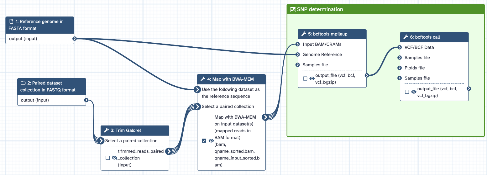

# bacsnp - Deciphering baculovirus populations

This repository accompanies the following publication and provides the code, data, and tools described therein:

-   Wennmann, J.T., Fan, J., Jehle, J.A. (2020). Bacsnp: Using Single Nucleotide Polymorphism (SNP) Specificities and Frequencies to Identify Genotype Composition in Baculoviruses. *Viruses*, [**https://doi.org/10.3390/v12060625**](https://doi.org/10.3390/v12060625).
-   Jörg Wennmann,  **Deciphering Virus Populations - Single Nucleotide Variants (SNVs) and Specificities in Baculovirus Isolates (Galaxy Training Materials)**. <https://training.galaxyproject.org/training-material/topics/variant-analysis/tutorials/baculovirus-isolate-variation/tutorial.html> Online; accessed Thu Feb 27 2025

## Introduction

Baculoviruses and other nuclear arthropod-specific large dsDNA viruses (NALDV) have large genomes of up to hundreds of kbp with up to hundreds of open reading frames (ORF). The size of the genome makes it very difficult to analyse the composition of virus populations, since current sequencing techniques cannot (Illumina sequencing) or can only with great difficulty (Nanopore sequencing) sequence entire genomes or significant genome fragments. Genetic markers such as insertion/deletion or single nucleotide polymorphisms (SNP) are usually used for virus population analysis. SNPs are particularly suitable for analysing intra-isolate specific variation, as there are many bioinformatic tools and workflows available and established to detect SNPs based on raw sequencing data (usually in fastq or fastqsanger format).

In virus populations, SNP positions can be used to count the frequency of the occurring nucleotides. In theory, A, T, G and C can occur in any position. The nucleotides can be determined using the sequencing data because not only one genome but a multitude of genomes is sequenced, which reflects the virus population including its genetic variations.

If some SNP positions are specific for a sequenced sample or isolate, then this position and the occurring nucleotide can be used as a marker to find this isolate/sample in other sequences, even if it is only present in a mixture with another type.

The ***bacsnp*** tool was developed to assign specificities to SNP positions. The tool is written in the R programming language and uses the Variant Call Format generated by Mpileup as input.

## Requirements

The bacsnp tool is developed in R programming language. Therefore, make sure that [R](https://a-little-book-of-r-for-bioinformatics.readthedocs.io/en/latest/src/installr.html) is installed and working. In addition, the devtools, vcfR and ggplot2 packages are required for bacsnp to work.

``` r
if (!requireNamespace("devtools", quietly = TRUE)) {
  install.packages("devtools")
}

if (!requireNamespace("ggplot2", quietly = TRUE)) {
  install.packages("ggplot2")
}

if (!requireNamespace("vcfR", quietly = TRUE)) {
  install.packages("vcfR")
}
```

## Installation

There are two ways to install the **bacsnp** package:

1.  Installation from GitHub (latest version)

    Until the package is available on CRAN, you can install the most recent version directly from GitHub. To do this, you need the devtools package, which can be installed as follows:

    ``` r
    library(devtools)

    install_github("https://github.com/wennj/bacsnp", build_vignettes = TRUE)
    ```

    The build_vignettes = TRUE argument ensures that the vignette (a detailed introduction and documentation of the package) is also installed.

2.  installation from CRAN (planed for future release)

    The bacsnp package is not yet available on CRAN. Once it is published, you will be able to install it directly from the R console with the following command:

    ``` r
    install.packages("bacsnp") #comming eventually soon
    ```

## Starting bacsnp package

After installation, you can load and use the package as usual:

``` r
library(bacsnp)
```

All required dependencies, such as vcfR and ggplot2, will be automatically installed during the installation process if they are not already available on your system.

------------------------------------------------------------------------

# Example workflow - Composition of an isolate of the Cydia pomonella granulovirus (CpGV)

Here, I would like to show you an example of how to analyse the composition of a baculovirus isolate using previously sequenced isolates. The Cydia pomonella granulovirus (CpGV) will serve as an example, as many isolates of this virus have already been sequenced and are available on the NCBI Genbank and NCBI SRA.

Using three CpGV isolates, we will work through the workflow step by step to decipher the composition of one isolate using the sequence data of the other three isolates. The workflow will use the following four isolates:

| Isolate | NCBI Genbank | NCBI SRA | Reference |
|------------------|------------------|------------------|------------------|
| CpGV-M | KM217575 | [SRR31589148](https://trace.ncbi.nlm.nih.gov/Traces?run=SRR31589148) | [Wennmann et al. 2020](https://doi.org/10.3390/v12060625) |
| CpGV-S | KM217573 | [SRR31589147](https://trace.ncbi.nlm.nih.gov/Traces?run=SRR31589147) | [Wennmann et al. 2020](https://doi.org/10.3390/v12060625) |
| CpGV-E2 | KM217577 | [SRR31589146](https://trace.ncbi.nlm.nih.gov/Traces?run=SRR31589146) | [Gueli Alletti et al. 2017](https://doi.org/10.3390/v9090250) |
| CpGV-V15 | not available | [SRR31679023](https://www.ncbi.nlm.nih.gov/sra/SRX27041396) | [Fan et al. 2020](https://doi.org/10.1093/ve/veaa073) |

The core of the analysis are variable SNP positions, which act as markers and can be specific for certain isolates. To determine variable SNP positions across several sequenced isolates, mpileup and bcftools are used. The output is in variant call format (VCF), which is the required input for the bacsnp tool. To create the VCF file, sequencing data can be processed with [usegalaxy.eu](#0). A Galaxy platform is particularly suitable for beginners, people who do not have sufficient computing capacity or do not regularly perform bioinformatic analyses.

## Galaxy Workflow

The bioinformatic pipeline for variable SNP position determination involves only four tools:

-   Trim Galore! ([Link](https://github.com/FelixKrueger/TrimGalore))

-   BWA-MEM ([Link](https://github.com/galaxyproject/tools-iuc/tree/main/tools/bwa))

-   mpileup ([Link](https://github.com/galaxyproject/tools-iuc/tree/main/tools/bcftools))

-   bcftools ([Link](https://github.com/galaxyproject/tools-iuc/tree/main/tools/bcftools))

How the tools interact and process the sequencing data, can be seen from the Galaxy workflow itself. There, you will also find all required individual parameters that have been set for each tool.

[Link to Galaxy workflow file.](doc/Galaxy-Workflow-bacsnp_SNP_calling_workflow.ga)

[Link to Galaxy workflow on usegalaxy.eu.](https://usegalaxy.eu/u/wennmannj/w/snp-calling-workflow-for-paired-list-imported-from-uploaded-file)



## Running the Galaxy workflow

In
